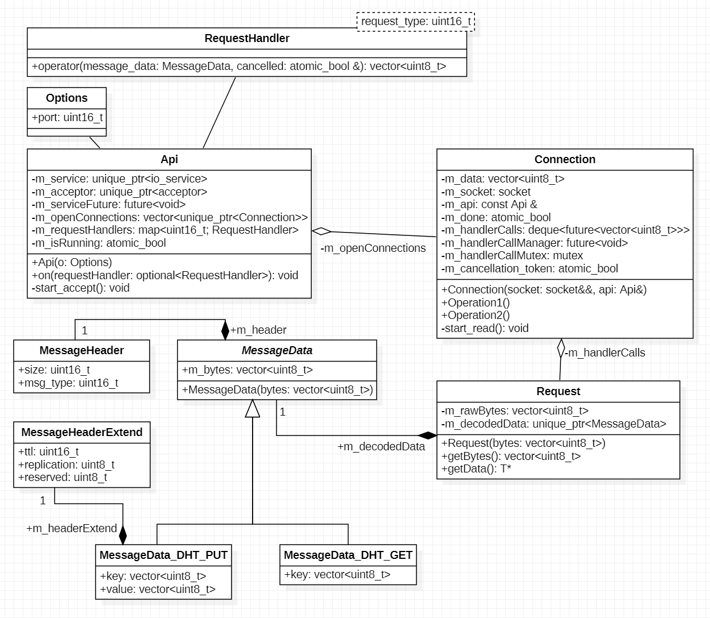
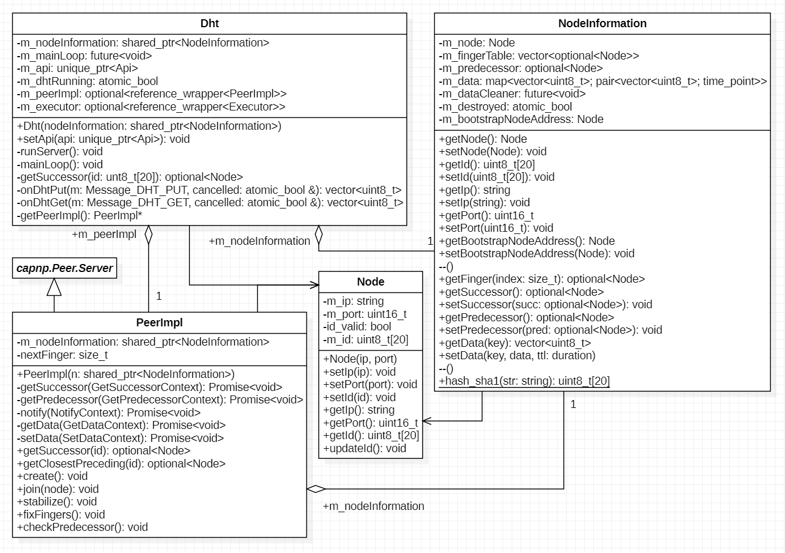

# Midterm report DHT-4

## Changes to assumptions in initial report
TODO

---

## Architecture of modules
The Project is separated into libraries, which speeds up compilation, makes unit testing easier, and reduces the risk of merge conflicts. Said libraries are:
- api
  - Responsible for inter-module communication.
  - Uses libasio for cross-platform networking.
- config
  - Uses inih to parse the configuration file.
- dht
  - The actual distributed hash table.
  - Responsible for p2p communication, maintaining the finger table, and storing/retrieving data.
- util
  - A collection of utility functions, as well as constants
- dht-4
  - The actual entrypoint of the program.
  - Parses command-line arguments, starts the DHT, and offers a command-line interface using stdin/stdout.

### Folder Structure
```
.
├── cmake
│   └── CPM.cmake
├── docs
├── src
│   ├── api
│   │   └── CMakeLists.txt
│   ├── config
│   │   └── CMakeLists.txt
│   ├── dht
│   │   └── CMakeLists.txt
│   ├── util
│   │   └── CMakeLists.txt
│   ├── dht-4.cpp
│   └── CMakeLists.txt
├── test
│   └── CMakeLists.txt
├── CMakeLists.txt
├── config.ini
└── README.md
```
---

### Logical structure

#### API


The core of the api library is the `Api` class. It listens for incoming connections, and maintains a list currently open connections. These connections then read and parse incoming requests, and pass those on to the appropriate `RequestHandler` (This depends on the message type). Those `RequestHandler`s are passed into the api from the outside.

#### DHT


The `Dht` class sets up the interface with the api by defining request handlers. The api now shares access to an instance of `NodeInformation` with the dht itself.  
`NodeInformation` stores the actual state of the node; including but not limited to:

- ip/port/id
- finger table
- predecessor
- the actual hash table to store data

The interface between peers is defined using a CapnProto schema, and the server-side of that is implemented in `PeerImpl`. This is where most of the actual dht logic takes place.

---

### Process architecture
The entire program takes place in one process, but using multithreading for asynchronicity. This is realized with `<future>` and `std::async`.
Most of the synchronized access happens within `NodeInformation`, which uses `std::shared_mutex`, `std::unique_lock`, and `std::shared_lock` for read-write locking. In some cases, a simple `std::atomic_bool` suffices.

### Networking (AsyncIO, goroutines, ...)

### Security measures (encryption/auth, ...)

## The peer-to-peer protocol(s) that is present in the implementation
---

### Message formats (as given in this document)

### Reasoning why the messages are needed

### Exception handling (Churn, connection breaks, corrupted data, ...)

## Future Work: Features you wanted to include in the implementation but couldn’t finish so far
---
## Workload Distribution — Who did what
---
## Effort spent for the project (please specify individual effort)
---


<style>
img {
  width: min(45em, 95vw);
}
h3, h4 {
  font-weight: bold;
}
</style>
